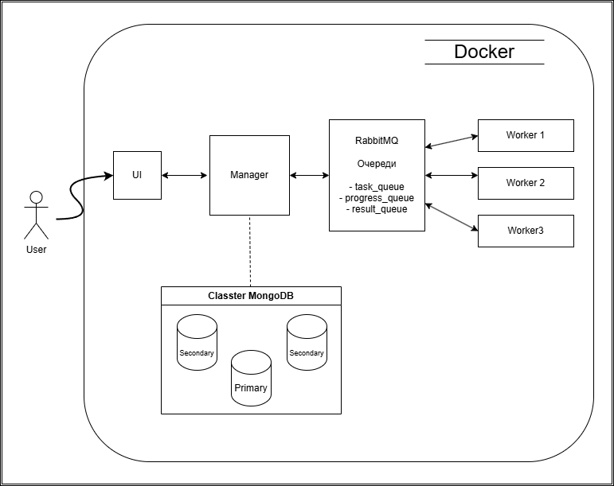

# Hash-Cracker_Fault-tolerance

## Описание

**HashCracker** — отказоустойчивая распределённая система для подбора паролей по MD5-хэшу.  
Система построена на архитектуре "менеджер-воркеры" с использованием очередей сообщений (`RabbitMQ`) и реплицируемой базы данных (`MongoDB`) для обеспечения надёжности и масштабируемости.



---

## Компоненты системы

- **Менеджер**
  - Принимает задачи от пользователей
  - Делит хеш на части и распределяет подзадачи воркерам через RabbitMQ
  - Получает результаты и сохраняет их в MongoDB
  - Проверяет статус воркеров и отслеживает прогресс

- **Воркеры**
  - Получают задания от менеджера через RabbitMQ
  - Выполняют перебор возможных паролей
  - Отправляют прогресс и результат обратно менеджеру
  - Проходят периодический health check

- **MongoDB с репликацией**
  - Используется для хранения задач, результатов и состояний
  - Обеспечивает отказоустойчивость и сохранность данных при сбоях

- **RabbitMQ**
  - Связывает менеджера и воркеров
  - Позволяет надёжно доставлять задачи и получать ответы, даже при перезапуске компонентов

- **UI (веб-интерфейс)**
  - Позволяет пользователю отправить задачу
  - Отображает статус и прогресс подбора
  - Показывает health статус воркеров
 
 
 ## Запуск

```bash
docker-compose up --build
```

## Доступ
- Интерфейс: http://localhost:8081
- Менеджер: http://localhost:8080
- RabbitMQ UI: http://localhost:15672 (Логин: user, пароль: password)

## Переменные окружения
Можно задать в `.env` или `docker-compose.yml`:  
```env
MANAGER_PORT=8080  # Порт менеджера  
WORKER_PORT=8081   # Порт воркеров  
TASK_TIMEOUT=PT1M  # Таймаут задачи
HASH_PARTS: "4"           # Количество частей, на которые делится хеш
LETTERS_AND_DIGITS: "abcdefghijklmnopqrstuvwxyz0123456789"  # Алфавит для перебора
PROGRESS_UPDATE_INTERVAL: "10000"  #Каждые каждые x итераций обновляется прогресс
```

## Масштабируемость
Можно запускать несколько воркеров для ускорения работы
Задаётся в `docker-compose.yml`: 
```
worker:
    deploy:
      replicas: 3
```

## Особенности и отказоустойчивость
- Менеджер сохраняет все входящие задачи и полученные ответы в MongoDB.
- Ответы от воркеров, доставленные в RabbitMQ во время перезапуска менеджера, не теряются.
- MongoDB работает в режиме репликации (replicaSet) — при падении primary-ноды система продолжает работу.
- RabbitMQ гарантирует доставку сообщений между сервисами даже при временных сбоях.
- Задачи автоматически переотправляются другим воркерам, если текущий воркер упал во время обработки.
